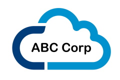

# Thinnest Viable Platform examples

Examples of a Thinnest Viable Platform (TVP) as defined in the book Team Topologies. 

> A TVP is a careful balance between keeping the platform small and ensuring that the platform is helping to accelerate and simplify software delivery  for teams building on the platfom. (p.101, _Team Topologies_)

This material is based on some of the ideas in the book _Team Topologies_ by Matthew Skelton [@matthewskelton](https://github.com/matthewskelton) and Manuel Pais [@manupaisable](https://github.com/manupaisable).

> See [teamtopologies.com](https://teamtopologies.com/) for more details about Team Topolologies.

> Copyright © 2018-2020 [Team Topologies](https://teamtopologies.com/) - Licenced under [CC BY-SA 4.0](https://creativecommons.org/licenses/by-sa/4.0/) 

## Canonical example of TVP

The ABC Corp example is perhaps the simplest infrastructure platform imaginable: just a list of cloud services and some default configuration.

---

### ABC Corp cloud platform

We use the [Serverless Framework](https://www.serverless.com/) to simplify access to AWS serverless services. Use these AWS services via Serverless to build apps for ABC Corp:

* AWS DynamoDB
* [AWS Lambda](https://www.serverless.com/aws-lambda)
* AWS S3
* AWS SQS

Use these events to trigger Lambda function execution:

* [Application Load Balancer](https://www.serverless.com/framework/docs/providers/aws/events/alb/)
* [DynamoDB](https://www.serverless.com/framework/docs/providers/aws/events/streams/)
* [HTTP API](https://www.serverless.com/framework/docs/providers/aws/events/http-api/)
* [S3](https://www.serverless.com/framework/docs/providers/aws/events/s3/)
* [Schedule](https://www.serverless.com/framework/docs/providers/aws/events/schedule/)
* [SQS](https://www.serverless.com/framework/docs/providers/aws/events/sqs/)

Use these services to monitor Lambda function execution:

* [AWS CloudWatch](https://docs.aws.amazon.com/AmazonCloudWatch/latest/monitoring/AlarmThatSendsEmail.html)

Use our credentials setup tool, `credible`, to set up your credentials for the Serverless framework, including all AWS IAM roles and access keys:

* [Link to `credible` tool]

---